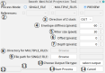

# Surface Projection Tool

## Installation:

1.Download the .jar file using the link below:

https://github.com/AnhMinhDo/SMPBasedMax2/releases/download/v0.1.0-beta/SMPBasedMax_2_1.0-SNAPSHOT.jar

2. In ImageJ/Fiji installation folder/directory, paste the .jar file in plugins folder/directory 

3. Restart Fiji

4. The plugin can be found in  ImageJ/Fiji Plugin menu

## User Interface:

**1** : The process modes selection

    - SINGLE_FILE: perform projection of the image selected in file path field (9) and save the output to the same directory of the input

    - MULTIPLE_FILES: batch processing  and saving of all the .tif images in directory path field (10)

    - PREVIEW: show the output image in a new window with a sub dialog for calibrating the parameters; 

                multiple preview windows can be opened simultaneously

**2** : Reference channel selection

For image with multiple channels, a channel must be selected as the reference channel. The surface projection is performed on only the reference channel and the output Z-map is applied on other channel.

The default selection is the first channel

**3** : The Direction of the Stack

    - OUT : The image stack is captured starting from inside the object and ending at the surface
    
    - IN : The image stack is captured starting from surface and moving inside the object

**4** : Envelope Stiffness

The distance\[pixels\] between the peaks in the Z-map of the surface projection; the higher the stiffness, the less noise and smoother the surface projection become. This should be tuned starting from stiffness=1 and increase until the output is the desire projection

**5** : Filter Size

The filter size for the median filter step. The median filter step helps in smoothing the z-map and contribute to the final smoothness. This can be set starting at around 10 and increase if needed

**6** : Offset

Move the Z-map of the surface projection into the stack

If the Direction (3) is OUT; set Offset to negative number since the surface at the high Z value, it needs to be subtracted to move into the stack

If the Direction (3) is IN; set Offset to positive number since the surface at the low Z value, it needs to be added to move into the stack

This should be kept at 0 if not needed

**7** : Depth

Add more intensity to the final projection by including more layers; This should be kept at 0 if not needed

**8** : path to the directory for MULTIPLE_FILES Mode

**9** : path to the image for SINGLE_FILE and PREVIEW mode

**10** : select the desired output files (Maximum intensity Projection(MIP) file, Z Map of the MIP, the Surface Projection, z map of the surface projection  )

**11** : status bar to show the notification to th users

**12** : Progress bar to show the progress of the current projection

**13** : Button to start the Surface Projection after all the parameters above have been selected

**14** : Cancel button to close the plugin

